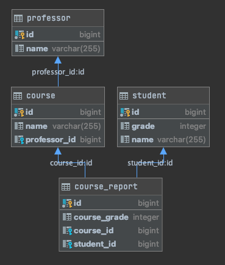

# 과연 Reactive 한 친구들이 정말 빠를까?
`JDBC` + `Spring Web MVC` "**Blocking**" vs `R2DBC` + `WebFlux` "**Non-Blocking / Reactive**"  
Reactive한 Spring이 얼마나 빠른지 궁금해서 실험을 해보았다.

  
대강 위와 같은 구조를 가진 Relational Model을 구축하고, 랜덤 데이터 약 2만 row를 생성했다.

각 Blocking / Non-Blocking Application은 
```sql
select c.id, c.name
from course c
         inner join professor p on p.id = c.professor_id
         inner join course_report cr on c.id = cr.course_id
         inner join student s on s.id = cr.student_id
where c.professor_id = $1;
```
위 sql을 실행 할 것이고, 쿼리 플랜은 아래와 같다.  
원래는 모든 종류의 Entity를 받아오는 쿼리를 구성하려 했으나, R2DBC에서 아직 Relational Mapping을 지원하지 않는다. 그래서 공평하게 Flat한 Row들만 가져오도록 같은 쿼리로 구성했다.
```
QUERY PLAN
Nested Loop  (cost=4.96..253.67 rows=450 width=14) (actual time=0.036..0.885 rows=452 loops=1)
  ->  Nested Loop  (cost=4.67..111.24 rows=450 width=22) (actual time=0.026..0.217 rows=452 loops=1)
        ->  Nested Loop  (cost=4.39..15.65 rows=11 width=14) (actual time=0.018..0.024 rows=11 loops=1)
              ->  Index Only Scan using professor_pkey on professor p  (cost=0.15..8.17 rows=1 width=4) (actual time=0.009..0.010 rows=1 loops=1)
                    Index Cond: (id = 1)
                    Heap Fetches: 1
              ->  Bitmap Heap Scan on course c  (cost=4.23..7.37 rows=11 width=22) (actual time=0.005..0.007 rows=11 loops=1)
                    Recheck Cond: (professor_id = 1)
                    Heap Blocks: exact=1
                    ->  Bitmap Index Scan on course_idx_professor_id  (cost=0.00..4.23 rows=11 width=0) (actual time=0.003..0.003 rows=11 loops=1)
                          Index Cond: (professor_id = 1)
        ->  Index Scan using course_report_idx_course_id on course_report cr  (cost=0.29..8.28 rows=41 width=16) (actual time=0.002..0.010 rows=41 loops=11)
              Index Cond: (course_id = c.id)
  ->  Index Only Scan using student_pkey on student s  (cost=0.29..0.32 rows=1 width=4) (actual time=0.001..0.001 rows=1 loops=452)
        Index Cond: (id = cr.student_id)
        Heap Fetches: 0
Planning Time: 0.382 ms
Execution Time: 0.955 ms
```

# Test Env
| Device   | 2019 Macbook Pro 16"   |
|----------|------------------------|
| CPU      | Intel I9 8-Core 2.4GHz |
| Memory   | 32 GB 2667 MHz DDR4    |
| Database | PostgreSQL 13.1        |

# How To Run

Run Blocking Spring Application (Port: 24895)
```bash
./gradlew :blocking:bootRun
```
Run Non Blocking Spring Application (Port: 24995)
```bash
./gradlew :non-blocking:bootRun
```
Blocking (JDBC + Web MVC) 프로젝트에 기본 Table 스키마 정의 + 시드 데이터를 넣어놓았다. `./gradlw :blocking:bootRun`을 먼저 실행하자.

# Test Routes
`/professor/{id}` (ex `/professor/2`)
