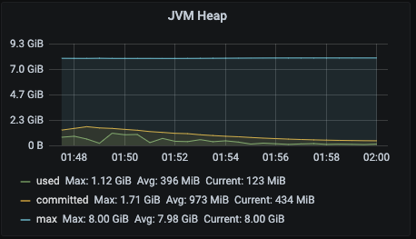
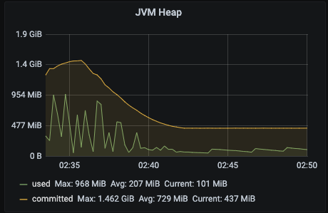

# 과연 Reactive 한 친구들이 정말 빠를까?
`JDBC` + `Spring Web MVC` "**Blocking**" vs `R2DBC` + `WebFlux` "**Non-Blocking / Reactive**"  
Reactive한 Spring이 얼마나 빠른지 궁금해서 실험을 해보았다.

  
대강 위와 같은 구조를 가진 Relational Model을 구축하고, 랜덤 데이터 약 2만 row를 생성했다.

각 Blocking / Non-Blocking Application은 
```sql
select c.id, c.name
from course c
         inner join professor p on p.id = c.professor_id
         inner join course_report cr on c.id = cr.course_id
         inner join student s on s.id = cr.student_id
where c.professor_id = $1;
```
위 sql을 실행 할 것이고, 쿼리 플랜은 아래와 같다.
```
QUERY PLAN
Nested Loop  (cost=4.96..253.67 rows=450 width=14) (actual time=0.036..0.885 rows=452 loops=1)
  ->  Nested Loop  (cost=4.67..111.24 rows=450 width=22) (actual time=0.026..0.217 rows=452 loops=1)
        ->  Nested Loop  (cost=4.39..15.65 rows=11 width=14) (actual time=0.018..0.024 rows=11 loops=1)
              ->  Index Only Scan using professor_pkey on professor p  (cost=0.15..8.17 rows=1 width=4) (actual time=0.009..0.010 rows=1 loops=1)
                    Index Cond: (id = 1)
                    Heap Fetches: 1
              ->  Bitmap Heap Scan on course c  (cost=4.23..7.37 rows=11 width=22) (actual time=0.005..0.007 rows=11 loops=1)
                    Recheck Cond: (professor_id = 1)
                    Heap Blocks: exact=1
                    ->  Bitmap Index Scan on course_idx_professor_id  (cost=0.00..4.23 rows=11 width=0) (actual time=0.003..0.003 rows=11 loops=1)
                          Index Cond: (professor_id = 1)
        ->  Index Scan using course_report_idx_course_id on course_report cr  (cost=0.29..8.28 rows=41 width=16) (actual time=0.002..0.010 rows=41 loops=11)
              Index Cond: (course_id = c.id)
  ->  Index Only Scan using student_pkey on student s  (cost=0.29..0.32 rows=1 width=4) (actual time=0.001..0.001 rows=1 loops=452)
        Index Cond: (id = cr.student_id)
        Heap Fetches: 0
Planning Time: 0.382 ms
Execution Time: 0.955 ms
```

# Test Env
| Device   | 2019 Macbook Pro 16"   |
|----------|------------------------|
| CPU      | Intel I9 8-Core 2.4GHz |
| Memory   | 32 GB 2667 MHz DDR4    |
| Database | PostgreSQL 13.1        |
| Stress Tool | Vegeta        |
| Monitoring | Prometheus, Grafana        |

# How To Run

Run Blocking Spring Application (Port: 24895)
```bash
./gradlew :blocking:bootRun
```
Run Non Blocking Spring Application (Port: 24995)
```bash
./gradlew :non-blocking:bootRun
```
Blocking (JDBC + Web MVC) 프로젝트에 기본 Table 스키마 정의 + 시드 데이터를 넣어놓았다. `./gradlw :blocking:bootRun`을 먼저 실행하자.

---
# JVM Warming Up
JVM에서 application 기동 시 초기부터 최고의 퍼포먼스를 보여주는 것이 아닌 [워밍업할 시간이 필요하다](https://dzone.com/articles/why-many-java-performance-test)는 글을 보았다.
꽤 오래된 글이기에, 지금도 그럴까? 싶어서 지켜봤더니, 메모리 사용량에서 그 현상이 나타났다.


  
(왼: Blocking Application, 오: Reactive Application)

이걸 반영해서, 양 측 모두 초기 기동 후 약 15분 가량 후 테스트를 진행했다.

## Test #1 (200 rate for 3m)
|               | Blocking | Reactive |
|---------------|----------|----------|
| TPS           | 200      | 200      |
| AVG Latency   | 4.868ms  | 7.102ms  |
| AVG Used Heap | 177 MiB  | 118 MiB  |
| AVG Cpu Usage | 1.21%    | 2.39%    |
| Grafana Snapshot | [Blocking](https://snapshot.raintank.io/dashboard/snapshot/9kHo2JIXJIGI5LhVDmeA1hf0bkm5lZRY) | [Non Blocking](https://snapshot.raintank.io/dashboard/snapshot/hPNlifvoJkpY5b6QosJkgYi34K6dB5C1)|

## Test #2 (400 rate for 3m)
|               | Blocking | Reactive |
|---------------|----------|----------|
| TPS           | 399.99   | 399.98   |
| AVG Latency   | 4.732ms  | 9.682ms  |
| AVG Used Heap | 162 MiB  | 134 MiB  |
| AVG Cpu Usage | 2.07%    | 4.65%    |
| Grafana Snapshot | [Blocking](https://snapshot.raintank.io/dashboard/snapshot/fFxF5D5eJFmDb9RFt7tf16LWAIKMhD3P) | [Non Blocking](https://snapshot.raintank.io/dashboard/snapshot/yX3tAxm7ybtfU3wT4Ea8ufOE2K0HiIcJ)|

## Test #3 (600 rate for 3m)
|               | Blocking | Reactive  |
|---------------|----------|-----------|
| TPS           | 599.99   | 599.81    |
| AVG Latency   | 5.021ms  | 232.857ms |
| AVG Used Heap | 153 MiB  | 153 MiB   |
| AVG Cpu Usage | 2.50%    | 5.96%     |
| Grafana Snapshot | [Blocking](https://snapshot.raintank.io/dashboard/snapshot/Dp3BAg6jaC5stjQCv5mLG2oit8G4fRZK) | [Non Blocking](https://snapshot.raintank.io/dashboard/snapshot/Y3uGsXk5sDjWLAZN1dbLJ7fUUctLKcO0)|

## Test #4 (800 rate for 3m)
(800 rate부터 기본 thread pool size로 동작하지 않아, max size 90으로 늘렸다..)
|               | Blocking | Reactive |
|---------------|----------|----------|
| TPS           | 800.00   | 799.99   |
| AVG Latency   | 5.11ms   | 7.903ms  |
| AVG Used Heap | 162 MiB  | 703 MiB  |
| AVG Cpu Usage | 3.19%    | 10.63%   |
| Grafana Snapshot | [Blocking](https://snapshot.raintank.io/dashboard/snapshot/I2WLT5WqueTHkzQ13q9pRc8IJ9kjVieG) | [Non Blocking](https://snapshot.raintank.io/dashboard/snapshot/SEePPMPFV4q7XYqbr1VRGNJp2BJcjx74)|

## Test #5 (1000 rate for 3m)
|               | Blocking | Reactive |
|---------------|----------|----------|
| TPS           | 999.95   | 999.98   |
| AVG Latency   | 5.51ms   | 9.44ms   |
| AVG Used Heap | 160 MiB  | 1.02 GiB |
| AVG Cpu Usage | 4.70%    | 10.78%   |
| Grafana Snapshot | [Blocking](https://snapshot.raintank.io/dashboard/snapshot/wE2fdly1uWb6Yl5BXbU6IrJWTX5lhqhQ) | [Non Blocking](https://snapshot.raintank.io/dashboard/snapshot/4UJdkeHIGne7bRJ5jacmWYF93pSHsNdj)|

## Test #6 (1500 rate for 3m)
|               | Blocking | Reactive |
|---------------|----------|----------|
| TPS           | 1499.95  | 1499.68  |
| AVG Latency   | 6.671ms  | 26.479ms |
| AVG Used Heap | 179 MiB  | 1.24 GiB |
| AVG Cpu Usage | 7.33%    | 26.09%   |
| Grafana Snapshot | [Blocking](https://snapshot.raintank.io/dashboard/snapshot/XT1f3QoVkrYRg4cQc24LN0mWKtfE5Rh5) | [Non Blocking](https://snapshot.raintank.io/dashboard/snapshot/cKZz8SWHQSOtj6lwE1JBx7VzVMsCK5lA)|

흠.. 테스트 환경이 무엇이 잘못되었을까?  
1. r2dbc의 pool size를 늘리는 것이 아니라 webflux worker thread 수를 늘려야 하나?
2. 단일 application이 아니라 여러 application을 띄워서 효율을 늘려야 하나?

일단 잘 모르겠다.

## Test #7 (without DB Connection, 7500 rate for 1m)
예제를 만들면서 느낀 것은, R2DBC 상에서는 Table 간 관계를 표현하는 것이 아직 지원이 되지 않다보니, 실무에서 사용하기에는 이르다고 느꼈다.
그럼 그냥 JDBC, R2DBC를 제외한 MVC vs WebFlux 간 성능만 측정해보자!

1. Blocking: `Thread.sleep(2)` 후 respond
2. Non Blocking (Coroutine): `delay(2)` 후 respond
3. Non Blocking (Reactor): `Mono.delay(Duration.ofMillis(2))`를 respond

[Blocking Test Result](https://snapshot.raintank.io/dashboard/snapshot/iraTJZN1oZTs6Jzfub7kV0i0NQ8orYy6)  
[Coroutine Non Blocking Test Result](https://snapshot.raintank.io/dashboard/snapshot/iraTJZN1oZTs6Jzfub7kV0i0NQ8orYy6)  
[Reactor Non Blocking Test Result](https://snapshot.raintank.io/dashboard/snapshot/1qWsakF2KwWSAGds2TbMzj7hMyjxZM4K)  

|                 | Blocking | Coroutine | Reactor  |
|-----------------|----------|-----------|----------|
| TPS             | 7499.71  | 7499.91   | 7289.77  |
| AVG Latency     | 2.568ms | 2.345ms  | 10.522ms |
| Threads         | 206      | 39        | 39       |
| Max Memory Used | 222 ~ 426 MiB  | 151 ~ 242 MiB   | 172 ~ 347 MiB  |
| Max Cpu Usage   | 8.81 %   | 8.03 %   | 8.05 %   |

Blocking, Non Blocking Application 모두 초기 기동할 떄 보다, 리퀘스트를 처리하기 시작한 후 1분후 쯤 메모리 사용량이 급격하게 낮아졌다. 그걸 감안해서 최초 리퀘스트 이후 2분부터 모니터링 하였음.

같은 WebFlux안에서, Controller가 Reactor로 구현 돼 있는 지, Coroutine으로 구현돼 있는지가 어떤 차이를 만들어낼까 싶어서 해봤는데 리소스 사용에 관해서는 큰 차이는 없었고 TPS에서 차이가 났다. 같은 rate로 요청을 해도 `connection reset by peer` 에러를 뿜으면서 더 많이 죽었다.  

JDBC를 쓰지 않고 순전히 WebFlux vs MVC를 비교했을 때, 사실 성능 차이는 크게 나지 않았다. 부하를 30%정도 더 적게 먹는다.
여기서 rate을 올려가면서 최대 TPS 확인하면 좋을 것 같다.


# 뼈 맞음
https://github.com/spring-projects/spring-data-r2dbc/issues/203
위 이슈에서, r2dbc member가 reactive pattern을 적용하는 주 이유는 속도/성능이 아닌 확장성과 회복력이라고 강조한다.  
나는 쉐도우 복싱을 한 걸까 
